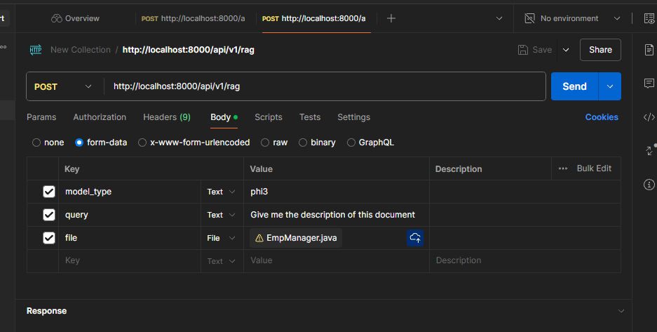

# LLMEngine

An API for chatting with multiple LLM models.

## Usage
`LLMEngine` currently has support of 
1. Ollama
2. GroqAPI

Using, `Ollama` you can run multiple LLM models on your devices. Some models supported using `Ollama` are
1. Llama3
2. phi3
3. gemma2b

Currently, `mixtral8x7b` is supported using `GroqAPI`.

To run this `engine`, you need to run this command
```
python main.py
```
------------
There are API endpoints
### 1. Chat with LLM
You can chat with the `supported` LLMs using this API.

```curl
http://localhost:8000/api/v1/prompt
```
In the `Body` you can give `prompt` and `model_type`
For example
```
{
    "prompt": "Fastest planet in the world",
    "model_type": "mixtral-8x7b-32768"
}
```

### 2. RAG with LLM
Yes, `Retrieval Augmented Generation (RAG)` is also supported in `LLMEngine`.

Hit this endpoint
```commandline
http://localhost:8000/api/v1/rag
```

In the `Body` pass, `model_type`, `query` and `file`


## TODO
1. Setup Support for more models
2. Shift `llama3` support to GroqAPI as it requires a lot of compute.
3. Add `SelfCorrectiveRAG` support in the API.
4. Add support for different types of files
5. Add WebsiteLoader support